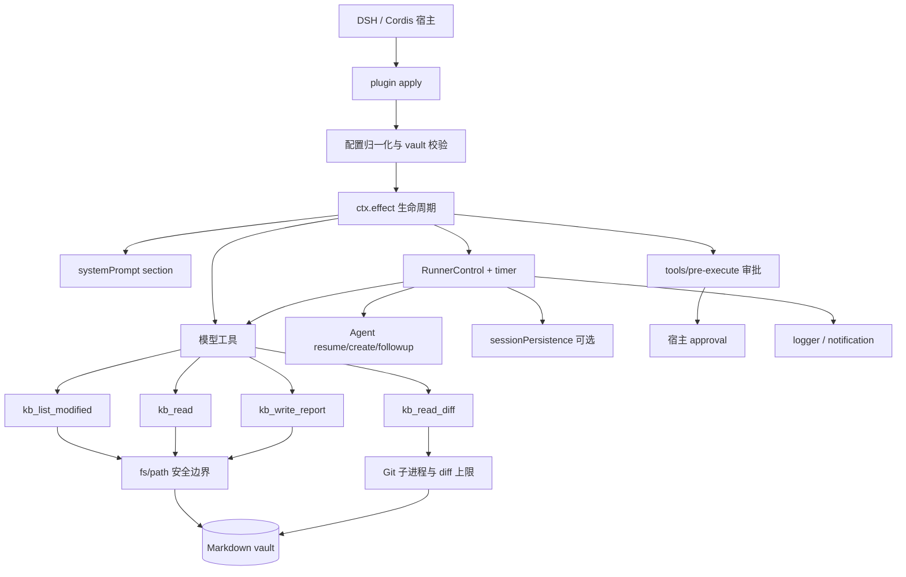

# 架构说明

## 总览

`@ly028716/dsh-kb-daily` 是一个 Cordis 函数插件。插件只负责把自己的 prompt、模型工具、审批 listener、timer、runner 和 Agent handle 放入同一个生命周期 effect，并在卸载时统一释放。

## 关键数据流

1. `apply()` 归一化单 Vault 或多 Vault 配置，校验目录、时区、路径 containment 和数值预算。
2. Cordis effect 注册 prompt、工具、审批和 runner。多 Vault 每个条目使用独立命名空间、Agent id 和生命周期。
3. runner 按配置时区计算本地日；日报已存在时跳过，否则恢复稳定 `agentId`，持久化不可用时创建新 Agent。
4. Agent 通过 `kb_list_modified`、`kb_read` 和可选 `kb_read_diff` 收集上下文，再通过 `kb_write_report` 请求写入。
5. `fs.ts` 对路径穿越、symlink/junction、UTF-8 截断、报告大小和独占创建做最后保护；`writePolicy: ask` 在写工具前经过宿主审批。
6. runner 观察工具结果，只记录耗时、读取文件数、截断次数、工具计数和失败类别。日志、通知和诊断不携带笔记正文或报告正文。

## 生命周期与失败边界

- 同一个本地日的重复 `runNow()` 共享在途任务，跨日任务排队，避免并发驱动同一个 Agent。
- runner 停止时取消本插件拥有的 Agent，等待在途任务收敛，再释放本插件创建的 handle。
- 写入审批等待、拒绝、超时和审批通道不可用分别映射到可观察状态；审批失败不会绕过宿主策略。
- Git 不可用、无历史、二进制文件和超限 diff 是工具级非致命错误；日报仍应明确披露 Git 来源不可用。

## 扩展边界

- 新的模型能力应优先通过工具结果和 prompt 约束接入，不应绕过 `fs.ts` 写入。
- 新的写入目标必须经过路径边界、审批和独占创建评审。
- 新的诊断字段必须证明不会泄露参数、路径、文件内容或报告内容。
